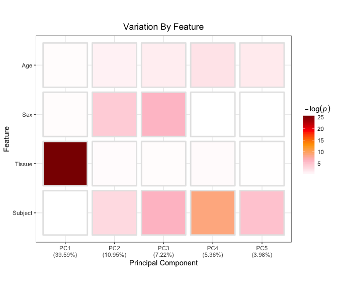
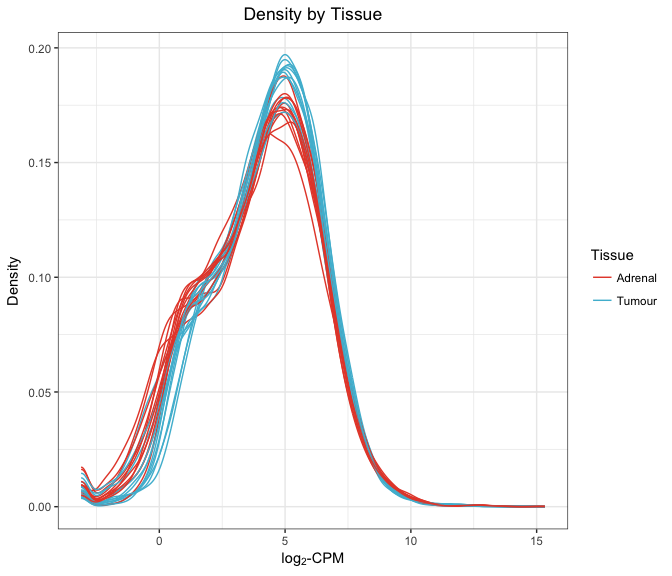
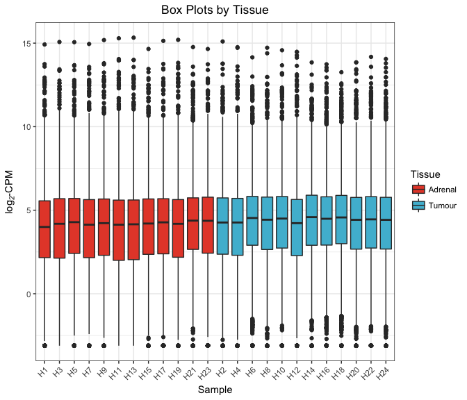
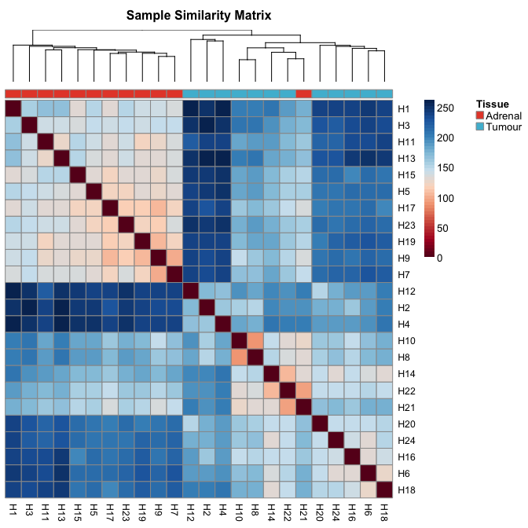
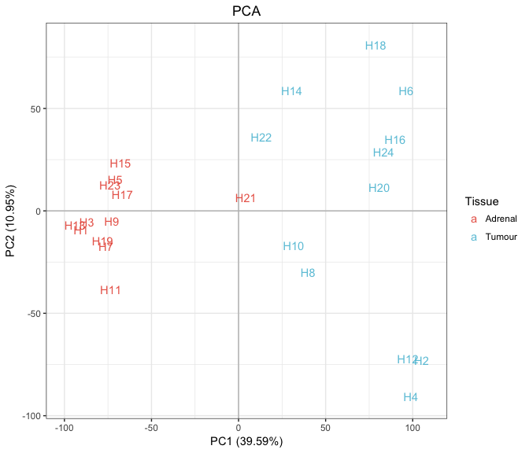
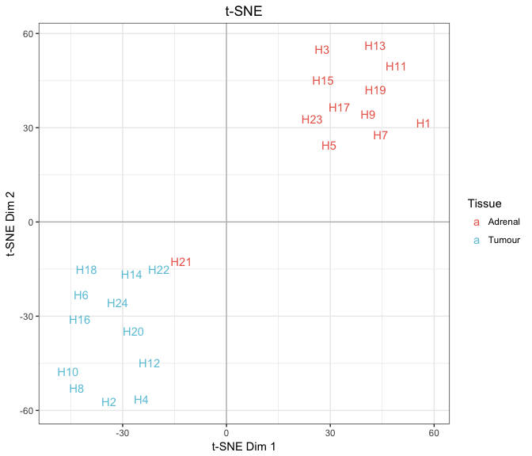
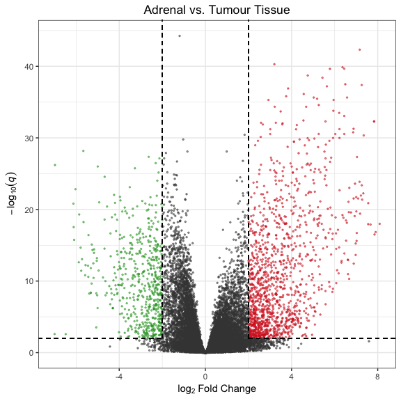
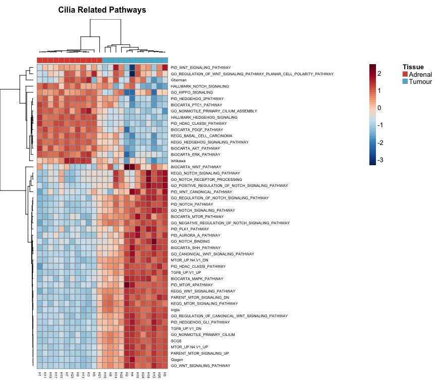

Human Tumour Data
================

-   [Import Data](#import-data)
-   [Filter, Transform Counts](#filter-transform-counts)
-   [Exploratory Data Analysis](#exploratory-data-analysis)
-   [Differential Expression Analysis](#differential-expression-analysis)
-   [Cilia Pathway Enrichment](#cilia-pathway-enrichment)
-   [Figures](#figures)

All analysis was conducted in R version 3.4.0 using the following script. Computations were performed on a MacBook Pro with 16GB of RAM and an i7 quad-core processor.

If you haven't already installed the `bioplotr` package, you'll need to do so to reproduce the figures below.

``` r
# Install bioplotr
devtools::install_github('dswatson/bioplotr')

# Load libraries
library(data.table)
library(tximport)
library(DESeq2)
library(edgeR)
library(qusage)
library(qvalue)
library(bioplotr)
library(dplyr)

# Set seed
set.seed(123)
```

Import Data
===========

Following RNA-seqencing of all samples, reads were pseudo-aligned using kallisto ([Bray et al., 2016](http://www.nature.com/nbt/journal/v34/n5/full/nbt.3519.html)). Our reference genome was [GRCh38.p2](http://mar2015.archive.ensembl.org/Homo_sapiens/Info/Index), Ensembl version 79. Transcript-level reads were aggregated to gene-level using the `tximport` package ([Soneson et al., 2015](https://f1000research.com/articles/4-1521/v2)).

For this portion of the study, we restrict our focus to paired samples.

``` r
# Import data
clin <- fread('./Data/Hs.Clinical.csv') %>% 
  filter(Paired == 'Paired')
t2g <- fread('./Data/Hs79.t2g.csv')
anno <- fread('./Data/Hs.anno.csv')
files <- file.path('./Data/Counts/Human', clin$Sample, 'abundance.tsv')
txi <- tximport(files, type = 'kallisto', tx2gene = t2g, importer = fread)
```

Filter, Transform Counts
========================

Before conducting exploratory data analysis (EDA), we remove genes with less than one count per million (CPM) in at least twelve libraries. This ensures that every gene is expressed in at least one of the two tissue types (tumour and adrenal). This threshold follows the filtering guidelines of [Robinson et al. (2010)](https://www.ncbi.nlm.nih.gov/pubmed/19910308). Counts are then RLE normalised ([Anders & Huber, 2010](https://genomebiology.biomedcentral.com/articles/10.1186/gb-2010-11-10-r106)) and converted to the log<sub>2</sub>-CPM scale to stabilise variance across the omic range.

``` r
# Create DESeqDataSet object
dds <- DESeqDataSetFromTximport(txi, colData = clin, design = ~ Subject + Tissue)

# Normalize counts
dds <- estimateSizeFactors(dds)

# Filter, transform counts
keep <- rowSums(cpm(counts(dds)) > 1) >= 12
mat <- dds[keep, ] %>%
  counts(normalized = TRUE) %>%
  cpm(log = TRUE, prior.count = 1)
colnames(mat) <- clin$Sample

# Check dimensionality
dim(mat)
```

    ## [1] 17430    24

EDA will proceed with 17,430 genes. (Note that gene filtering is performed separately for differential expression analysis. We will make use of this EDA filter when testing for pathway enrichment, however. See below.)

Exploratory Data Analysis
=========================

We begin with a heatmap to visualise the strength of associations between clinical variables and the principal components of the transformed count matrix.

``` r
pheno <- clin %>% select(Sample, Subject, Tissue, Sex, Age)
plot_drivers(mat, pheno, n.pc = 5)
```

    ## # A tibble: 4 x 2
    ##   Feature     Class
    ##     <chr>     <chr>
    ## 1 Subject character
    ## 2  Tissue character
    ## 3     Sex character
    ## 4     Age   integer

<p align='center'>

</p>

Tissue type is clearly the dominant source of variation in the data. (Good!)

With this knowledge in hand, we can move on to density and box plots, coloured by tissue type.

``` r
lcpm <- expression(log[2]*'-CPM')
plot_density(mat, group = list(Tissue = clin$Tissue), xlab = lcpm) 
```

<p align='center'>

</p>

``` r
plot_box(mat, group = list(Tissue = clin$Tissue), ylab = lcpm)
```

<p align='center'>

</p>

We see here that the data are indeed approximately normal following our preprocessing steps above. There are no clear outliers in the study, and differences across libraries look fairly reasonable.

Next we build a sample similarity matrix by calculating the pairwise [Euclidean distance](https://en.wikipedia.org/wiki/Euclidean_distance) between all samples in the data. This matrix is then visualised as a heatmap and used to generate a hierarchical clustering dendrogram.

``` r
plot_similarity(mat, group = list(Tissue = clin$Tissue))
```

<p align='center'>

</p>

We find here that samples are perfectly separated by tissue type, with the exception of H21, which is wrongfully grouped with tumour samples. Interestingly, this sample clusters closely with H22, which is the matching tumour sample taken from the same patient.

[Principal component analysis (PCA)](https://en.wikipedia.org/wiki/Principal_component_analysis) sheds a little more light on the data’s internal structure.

``` r
plot_pca(mat, group = list(Tissue = clin$Tissue), label = TRUE)
```

<p align='center'>

</p>

The first principal component, which accounts for over 40% of variation in the data, clearly separates the samples by tissue type. Note how tumour samples are spread along the second principal component, indicating a heterogeneity in this group that is absent in adrenal tissue, where samples cluster together quite nicely. H21 appears almost stranded between the two groups, hovering near the plot's origin.

Another approach to projecting high-dimensional datasets with just two axes is [t-distributed stochastic neighbour embedding (t-SNE)](https://en.wikipedia.org/wiki/T-distributed_stochastic_neighbor_embedding). This method, originally developed by [van der Maaten & Hinton (2008)](http://www.jmlr.org/papers/volume9/vandermaaten08a/vandermaaten08a.pdf), explicitly attempts to preserve local structure when mapping a large matrix onto a low-dimensional subspace. It is therefore ideal for unsupervised cluster detection.

``` r
plot_tsne(mat, group = list(Tissue = clin$Tissue), label = TRUE)
```

<p align='center'>

</p>

We find much neater separation of samples here, although the algorithm's emphasis on preserving each data point's proximity to its nearest neighbours has obscured the heterogeneity of tumour samples evident in the PCA plot. Sample H21's misclassification is particularly apparent in this figure, although once again he remains quite close to his paired sample in this projection, suggesting a true biological link between the two.

Differential Expression Analysis
================================

We use the [DESeq2](https://bioconductor.riken.jp/packages/3.0/bioc/html/DESeq2.html) software package to test for differential expression. This pipeline RLE normalises the raw count matrix; estimates genewise dispersion parameters using an empirical Bayes approach; fits negative binomial models to each gene according to the specified design; and performs independent gene filtering to maximise the number of differentially expressed genes while controlling the false discovery rate (FDR). See the original paper by [Love, Huber & Anders (2014)](https://genomebiology.biomedcentral.com/articles/10.1186/s13059-014-0550-8) for details.

``` r
# Run full pipeline
dds <- DESeq(dds)
```

We modify the default results output to standardise the data frame for downstream visualisations and add the relevant annotations.

``` r
top_genes <- dds %>%
  results(contrast = c('Tissue', 'Tumour', 'Adrenal'),
          filterfun = ihw, alpha = 0.01, tidy = TRUE) %>%
    mutate(AvgExpr = log2(baseMean / 1e6)) %>%
    na.omit(.) %>%
    rename(EnsemblID = row,
               logFC = log2FoldChange,
             p.value = pvalue,
             q.value = padj) %>%
    arrange(p.value) %>%
    inner_join(anno, by = 'EnsemblID') %>%
    select(EnsemblID, GeneSymbol, Description, 
           AvgExpr, logFC, p.value, q.value)
```

How many genes are differentially expressed at 1% FDR?

``` r
sum(top_genes$q.value <= 0.01)
```

    ## [1] 7660

What proportion of all genes that passed independent filtering does that represent?

``` r
sum(top_genes$q.value <= 0.01) / nrow(top_genes)
```

    ## [1] 0.3367921

More than a third of all genes are differentially expressed at 1% FDR, indicating a very strong transcriptomic signal associated with tissue type.

Cilia Pathway Enrichment
========================

We are concerned with the impact of pheochromocytoma (PCC) on cilia. We therefore compiled a list of 49 known cilia-related pathways from public databases including [Gene Ontology](http://www.geneontology.org/) and the [Kyoto Encyclopedia of Genes and Genomes](http://www.genome.jp/kegg/). To test for enrichment in these pathways, we used a slightly modified version of the QuSAGE algorithm ([Yaari et al., 2013](https://www.ncbi.nlm.nih.gov/pubmed/23921631); [Turner et al., 2015](https://bmcbioinformatics.biomedcentral.com/articles/10.1186/s12859-015-0707-9)) designed for use with RNA-seq data.

``` r
# Load cilia pathways
cilia <- readRDS('./Data/Hs.cilia.rds')

# Filter out underexpressed genes using our EDA filter
dds <- dds[keep, ]

# Identify the number of samples, genes, and coefficients to be estimated
n <- ncol(dds)
g <- nrow(dds)
p <- ncol(model.matrix(design(dds), colData(dds)))

# Create a new results table and extract relevant values
dds_res <- results(dds, contrast = c('Tissue', 'Tumour', 'Adrenal'),
                   independentFiltering = FALSE)
mean <- dds_res$log2FoldChange
SD <- dds_res$lfcSE
sd.alpha <- rep(1, times = g)
dof <- rep((ncol(dds) - p), times = g) 
names(mean) <- names(SD) <- names(sd.alpha) <- names(dof) <- rownames(dds)

# Extract residual matrix on the log2-CPM scale
cnts <- dds %>%
  counts(normalized = TRUE) %>%
  cpm(log = TRUE, prior.count = 1)
signal_mat <- (assays(dds)[['mu']] / normalizationFactors(dds)) %>%
  cpm(log = TRUE, prior.count = 1)
resid_mat <- cnts - signal_mat

# Run QuSAGE pipeline
overlap <- sapply(cilia, function(g) sum(g %in% rownames(dds)))
cilia <- cilia[overlap > 1]
res <- newQSarray(mean = mean, SD = SD, sd.alpha = sd.alpha, dof = dof,
                  labels = rep('resid', n))
res <- aggregateGeneSet(res, cilia, 2^14)     
res <- calcVIF(resid_mat, res, useCAMERA = FALSE) 
top_pathways <- res %>%
  qsTable(number = Inf, sort.by = 'p') %>%
  rename(Pathway = pathway.name,
           logFC = log.fold.change,
         p.value = p.Value) %>%
  mutate(q.value = qvalue(p.value)$qvalues) %>%
  select(-FDR)
```

How many pathways are significantly enriched at 10% FDR?

``` r
sum(top_pathways$q.value <= 0.1)
```

    ## [1] 17

What proportion of all pathways does that represent?

``` r
sum(top_pathways$q.value <= 0.1) / nrow(top_pathways)
```

    ## [1] 0.3469388

More than a third of all cilia-related pathways are significantly enriched at 10% FDR, once again suggesting a strong transcriptomic signal differentiating between tumour and adrenal samples.

Figures
=======

To get a sense for the symmetry and magnitude of effects, we visualise the results from our differential expression analysis using a volcano plot. We highlight those genes with FDR of at most 1% and absolute LFC of at least 2.

``` r
plot_volcano(top_genes, fdr = 0.01, lfc = 2, title = 'Adrenal vs. Tumour Tissue')
```

<p align='center'>

</p>

We find here that there is considerable differential expression throughout the dynamic range of the counts. There is more upregulation than downregulation in this contrast, including a few genes with especially extreme fold changes that may warrant further investigation.

To visualise differences at the pathway level, we first create a matrix of eigengenes by taking the first principal component of each pathway across all samples. This matrix can then be plotted as a heatmap.

``` r
# Create eigengene matrix
pathway_mat <- matrix(nrow = length(cilia), ncol = ncol(mat),
                      dimnames = list(names(cilia), colnames(mat)))
for (p in seq_along(cilia)) {
  tmp <- mat[rownames(mat) %in% cilia[[p]], ]
  pca <- prcomp(t(tmp))
  pathway_mat[p, ] <- pca$x[, 1]
}

# Plot results
plot_heatmap(pathway_mat, group = list(Tissue = clin$Tissue), 
             title = 'Cilia Related Pathways')
```

<p align='center'>

</p>

This heatmap reveals several interesting features of the data. First of all, H21 has been successfully classified with adrenal samples here -- but only just. He is still an outlier among the cohort, and his pathway expression profile looks remarkably similar to those from the nearest clade of tumour samples, which form a clear subgroup within the cancer samples. The rowwise dendrogram also clearly delineates between two groups of pathways, which may provide clues into underlying biological mechanisms of the cilia life cycle in patients with PCC.
