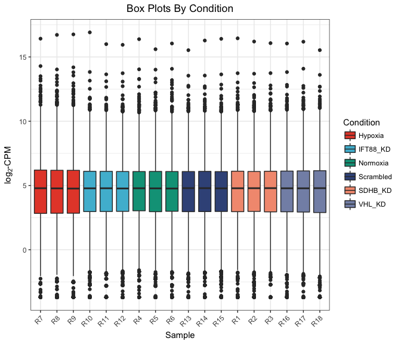
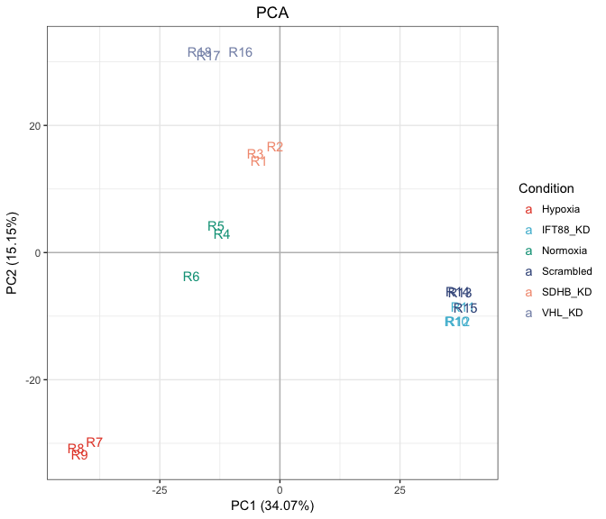
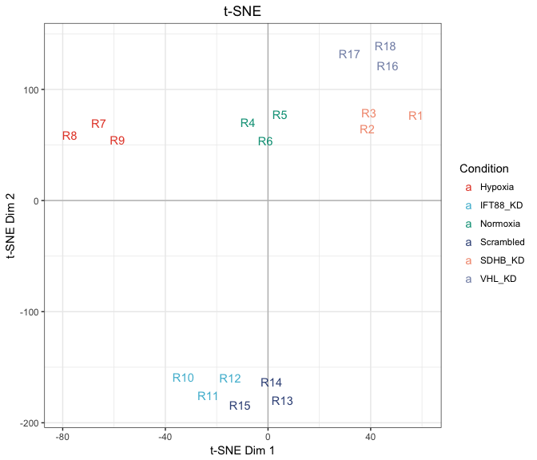

Rat Gene Knockout
================

-   [Import Data](#import-data)
-   [Filter, Transform Counts](#filter-transform-counts)
-   [Exploratory Data Analysis](#exploratory-data-analysis)
-   [Differential Expression Analysis](#differential-expression-analysis)
-   [Pathway Enrichment](#pathway-enrichment)
-   [Figures](#figures)

All analysis was conducted in R version 3.4.0 using the following script. Computations were performed on a MacBook Pro with 16GB of RAM and an i7 quad-core processor.

If you haven't already installed the `bioplotr` package, you'll need to do so to reproduce the figures below.

``` r
# Install bioplotr
devtools::install_github('dswatson/bioplotr')

# Load libraries
library(data.table)
library(tximport)
library(DESeq2)
library(edgeR)
library(qusage)
library(bioplotr)
library(dplyr)

# Set seed
set.seed(123)
```

Import Data
===========

Following RNA-seqencing of all samples, reads were pseudo-aligned using kallisto ([Bray et al., 2016](http://www.nature.com/nbt/journal/v34/n5/full/nbt.3519.html)). Our reference genome was [Rnor\_6.0](http://dec2015.archive.ensembl.org/Rattus_norvegicus/Info/Index), Ensembl version 83. Transcript-level reads were aggregated to gene-level using the `tximport` package ([Soneson et al., 2015](https://f1000research.com/articles/4-1521/v2)).

``` r
# Import data
anno <- fread('./Data/Rn.anno.csv')
clin <- fread('./Data/Rn.Clinical.csv') 
t2g <- fread('./Data/Rn83.t2g_Symbol.csv')
files <- file.path('./Data/Counts/Rat', clin$Sample, 'abundance.tsv')
txi <- tximport(files, type = 'kallisto', tx2gene = t2g, importer = fread)
```

Filter, Transform Counts
========================

Before conducting exploratory data analysis (EDA), we remove genes with less than one count per million (CPM) in at least three libraries. This ensures that every gene is expressed in at least one condition. This threshold follows the filtering guidelines of [Robinson et al. (2010)](https://www.ncbi.nlm.nih.gov/pubmed/19910308). Counts are then RLE normalised ([Anders & Huber, 2010](https://genomebiology.biomedcentral.com/articles/10.1186/gb-2010-11-10-r106)) and converted to the log<sub>2</sub>-CPM scale to stabilise variance across the omic range.

``` r
# Filter, transform counts
keep <- rowSums(cpm(txi$counts) > 1) >= 3
mat <- DGEList(txi$counts[keep, ])
mat <- calcNormFactors(mat, method = 'RLE')
mat <- cpm(mat, log = TRUE, prior.count = 1)
colnames(mat) <- clin$Sample

# Check dimensionality
dim(mat)
```

    ## [1] 13621    18

EDA will proceed with 13,490 genes. (Note that gene filtering is performed separately for differential expression analysis. We will make use of this EDA filter when testing for pathway enrichment, however. See below.)

Exploratory Data Analysis
=========================

We begin with density and box plots, coloured by condition.

``` r
lcpm <- expression(log[2]*'-CPM')
plot_density(mat, group = list(Condition = clin$Condition), xlab = lcpm) 
```

<p align='center'>

</p>

``` r
plot_box(mat, group = list(Condition = clin$Condition), ylab = lcpm)
```

<p align='center'>

</p>

We see here that the data are indeed approximately normal following log<sub>2</sub>-CPM transform. There are no clear outliers in the study, and differences across libraries look fairly reasonable. The hypoxia rats demonstrate a slightly more platykurtic distribution of expression values than the other groups, which may lead them to cluster together in subsequent analyses.

To test that theory, we build a sample similarity matrix by calculating the pairwise [Euclidean distance](https://en.wikipedia.org/wiki/Euclidean_distance) between all samples in the data. This matrix is then visualised as a heatmap and used to generate a hierarchical clustering dendrogram.

``` r
plot_similarity(mat, group = list(Condition = clin$Condition))
```

<p align='center'>

</p>

We find here that samples are perfectly separated by condition, with the hypoxia rats earning their own clade off to the side. This plot also indicates that the IFT88 KD and Scrampled groups are quite closely related.

[Principal component analysis (PCA)](https://en.wikipedia.org/wiki/Principal_component_analysis) sheds a little more light on the data's internal structure.

``` r
plot_pca(mat, group = list(Condition = clin$Condition), label = TRUE)
```

<p align='center'>

</p>

This figure largely corroborates the findings from the sample similarity matrix above. Samples from all conditions cluster together quite nicely, with considerable overlap between the IFT88 KD and Scrambled groups. In fact, the first principal component, which accounts for over a third of variance in the data, primarily serves to separate these two conditions from all other samples, with hypoxia rats appearing the furthest removed. The second principal component, which accounts for a little less than half as much variance as the first, spreads the remaining groups apart. It does not seem to create much space between the IFT88 KD and Scrambled samples, however.

Another approach to projecting high-dimensional datasets with just two axes is [t-distributed stochastic neighbour embedding (t-SNE)](https://en.wikipedia.org/wiki/T-distributed_stochastic_neighbor_embedding). This method, originally developed by [van der Maaten & Hinton (2008)](http://www.jmlr.org/papers/volume9/vandermaaten08a/vandermaaten08a.pdf), explicitly attempts to preserve local structure when mapping a large matrix onto a low-dimensional subspace. It is therefore ideal for unsupervised cluster detection.

``` r
plot_tsne(mat, group = list(Condition = clin$Condition), label = TRUE)
```

<p align='center'>

</p>

This plot is almost identical to the PCA figure above, although we find a little more separation here between IFT88 KD and Scrambled samples, which makes it a little easier on the eyes.

Differential Expression Analysis
================================

We use the [DESeq2](https://bioconductor.riken.jp/packages/3.0/bioc/html/DESeq2.html) software package to test for differential expression. This pipeline RLE normalises the raw count matrix; estimates genewise dispersion parameters using an empirical Bayes approach; fits negative binomial models to each gene according to the specified design; and performs independent gene filtering to maximise the number of differentially expressed genes while controlling the false discovery rate (FDR). See the original paper by [Love, Huber & Anders (2014)](https://genomebiology.biomedcentral.com/articles/10.1186/s13059-014-0550-8) for details.

``` r
# Create DESeqDataSet object
dds <- DESeqDataSetFromTximport(txi, colData = clin, design = ~ Condition)

# Run full pipeline
dds <- DESeq(dds)
```

We modify the default results output to standardise the data frame for downstream visualisations and add the relevant annotations. Below, we focus on the contrast between hypoxia and normoxia.

``` r
top_genes <- as.data.frame(results(dds, filterfun = ihw, alpha = 0.05, 
                                   contrast = c('Condition', 'Hypoxia', 'Normoxia'))) %>%
    mutate(GeneSymbol = rownames(dds),
              AvgExpr = log2(baseMean / 1e6L)) %>%
    na.omit() %>%
    rename(logFC = log2FoldChange,
         p.value = pvalue,
             FDR = padj) %>%
    arrange(p.value) %>%
    inner_join(anno, by = 'GeneSymbol') %>%
    select(GeneSymbol, Description, AvgExpr,
           logFC, p.value, FDR)
```

How many genes are differentially expressed at 1% FDR?

``` r
sum(top_genes$FDR <= 0.01)
```

    ## [1] 3830

What proportion of all genes that passed independent filtering does that represent?

``` r
sum(top_genes$FDR <= 0.01) / nrow(top_genes)
```

    ## [1] 0.266546

Over a quarter of all genes are differentially expressed between these two conditions, indicating a strong transcriptomic signal distinguishing hypoxia from normoxia samples.

Pathway Enrichment
==================

We are concerned with the impact of pheochromocytoma (PCC) on cilia. We therefore compiled a list of 106 known cilia-related pathways from public databases including [Gene Ontology](http://www.geneontology.org/) and the [Kyoto Encyclopedia of Genes and Genomes](http://www.genome.jp/kegg/). To test for enrichment in these pathways, we used a slightly modified version of the QuSAGE algorithm ([Yaari et al., 2013](https://www.ncbi.nlm.nih.gov/pubmed/23921631); [Turner et al., 2015](https://bmcbioinformatics.biomedcentral.com/articles/10.1186/s12859-015-0707-9)) designed for use with RNA-seq data.

``` r
# Load cilia pathways
cilia <- readRDS('./Data/Rn.cilia.rds')

# Filter out underexpressed genes using EDA filter
dds <- dds[keep, ]

# Identify the number of samples, genes, and coefficients to be estimated
n <- ncol(dds)
g <- nrow(dds)
p <- ncol(model.matrix(design(dds), colData(dds)))

# Create a new results table and extract relevant values
dds_res <- results(dds, independentFiltering = FALSE)
mean <- dds_res$log2FoldChange
SD <- dds_res$lfcSE
sd.alpha <- rep(1, times = g)
dof <- rep((ncol(dds) - p), times = g) 
names(mean) <- names(SD) <- names(sd.alpha) <- names(dof) <- rownames(dds)

# Extract residual matrix on the log2-CPM scale
cnts <- counts(dds, normalized = TRUE)
cnts <- cpm(cnts, log = TRUE, prior.count = 1)
signal_mat <- assays(dds)[['mu']] / normalizationFactors(dds)
signal_mat <- cpm(signal_mat, log = TRUE, prior.count = 1)
resid_mat <- cnts - signal_mat

# Run QuSAGE pipeline
overlap <- sapply(cilia, function(g) sum(g %in% rownames(dds)))
cilia <- cilia[overlap > 1]
res <- newQSarray(mean = mean, SD = SD, sd.alpha = sd.alpha, dof = dof,
                  labels = rep('resid', n))
res <- aggregateGeneSet(res, cilia, 2^14)     
res <- calcVIF(resid_mat, res, useCAMERA = FALSE) 
top_pathways <- qsTable(res, number = Inf, sort.by = 'p') %>%
  rename(Pathway = pathway.name,
           logFC = log.fold.change,
         p.value = p.Value)
```

How many pathways are significantly enriched at 5% FDR?

``` r
sum(top_pathways$FDR <= 0.01)
```

    ## [1] 16

What proportion of all pathways does that represent?

``` r
sum(top_pathways$FDR <= 0.01) / nrow(top_pathways)
```

    ## [1] 0.1758242

Nearly one fifth of all cilia-related pathways are significantly enriched, once again suggesting a strong transcriptomic signal differentiating between hypoxia and normoxia samples.

Figures
=======

To get a sense for the symmetry and magnitude of effects, we visualise the results from our differential expression analysis using a volcano plot. We highlight those genes with FDR of at most 1% and absolute LFC of at least 1.

``` r
plot_volcano(top_genes, fdr = 0.01, lfc = 1, title = 'Hypoxia vs. Normoxia')
```

<p align='center'>

</p>

We find here that there is considerable differential expression throughout the dynamic range of the counts. There is more upregulation than downregulation in this contrast, including a few genes with especially extreme fold changes that may warrant further investigation.

To visualise effects at the pathway level, we first create a matrix of eigengenes by taking the first principal component of each pathway across all samples. This matrix can then be plotted as a heatmap.

``` r
# Create eigengene matrix
pathway_mat <- matrix(nrow = length(cilia), ncol = ncol(mat),
                      dimnames = list(names(cilia), colnames(mat)))
for (p in seq_along(cilia)) {
  tmp <- mat[rownames(mat) %in% cilia[[p]], ]
  pca <- prcomp(t(tmp))
  pathway_mat[p, ] <- pca$x[, 1]
}

# Plot results
plot_heatmap(pathway_mat, group = list(Condition = clin$Condition), 
             title = 'Cilia Related Pathways')
```

<p align='center'>

</p>

This heatmap reveals several interesting features of the data. Once again, we find that IFT88 KD and Scrambled samples are far more alike than any other two conditions. In fact, the groups are so similar that they have been misclassified by the hierarchical clustering dendrogram in one case. The effects distinguishing these two conditions from the other three are far stronger, for instance, than those separating normoxia from hypoxia samples in these pathways. The collection of pathways separating them from others could be a good place to start when investigating the relationship between cilia development and PCC.
